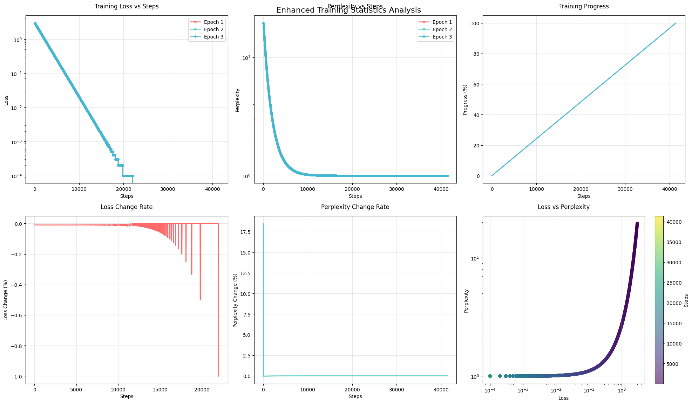
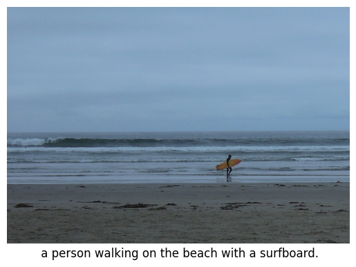
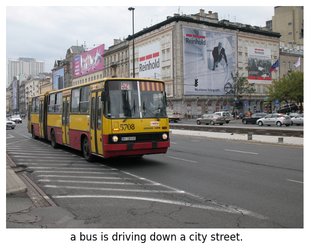
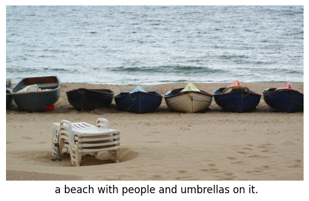
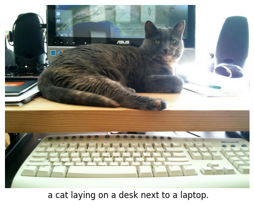
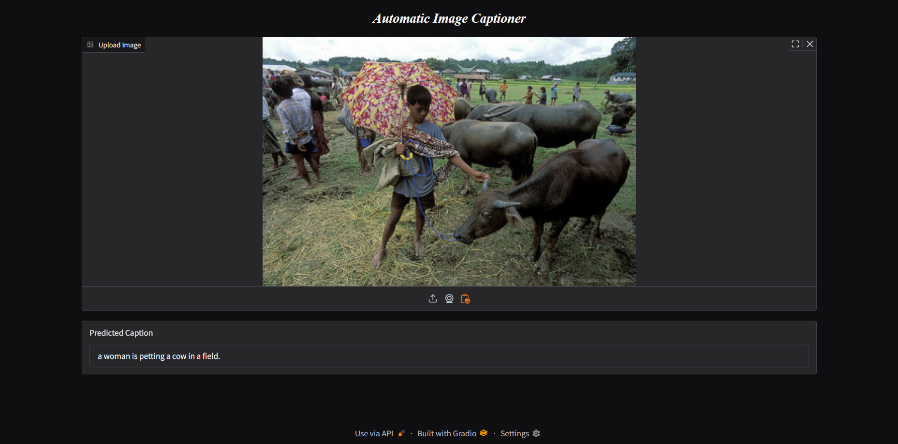

# Automatic Image Captioning using PyTorch on COCO Dataset  

## Project Overview  
This project focuses on generating captions for images using a neural network architecture that combines Convolutional Neural Networks (CNNs) as the Encoder and Long Short-Term Memory (LSTM) networks as the Decoder. The model is trained on the Microsoft Common Objects in Context [(MS COCO)](http://cocodataset.org/#home) dataset.  

The architecture follows the encoder-decoder approach, where the CNN encoder extracts image features, and the LSTM decoder generates captions word by word. This project is inspired by the paper "[Show and Tell: A Neural Image Caption Generator](https://arxiv.org/pdf/1411.4555.pdf)".  

  

After training, the model is evaluated on unseen images to assess its captioning ability.  

---

## Environment Setup  
The model was developed and trained on Google Colab to ensure it can run independently of any environment. It is deployed using Gradio on Windows, and can also be run on Linux and macOS with minor modifications.  

### 1. Clone the Repository  
```shell
git clone https://github.com/Sreeja-Nukarapu/Automatic-Image-Captioning-using-PyTorch-on-COCO-Dataset.git
cd Automatic-Image-Captioning-using-PyTorch-on-COCO-Dataset
```

### 2. Create a Virtual Environment  
Create and activate a new environment named `captioning_env` using Python 3.10:  
```shell
conda create -n captioning_env python=3.10
conda activate captioning_env  
```

### 3. Install Dependencies  
Ensure all required libraries are installed, including PyTorch, torchvision, nltk, and Matplotlib:  
```shell
pip install -r requirements.txt
```

### 4. Open Jupyter Notebooks  
Navigate to the project directory and launch Jupyter Notebooks:  
```shell
cd Automatic-Image-Captioning-using-PyTorch-on-COCO-Dataset
open Automatic_Image_Captioner.ipynb
```

Ensure that the kernel is set to the `captioning_env` environment (`Kernel > Change Kernel > captioning_env`).  

---

## Dataset: MS COCO  
The **Microsoft Common Objects in Context (MS COCO)** dataset is widely used for scene understanding tasks like object detection, segmentation, and image captioning.  

### Dataset Setup  
1. Clone the COCO API:  
```shell
git clone https://github.com/cocodataset/cocoapi.git
cd cocoapi/PythonAPI  
make  
cd ..
```

2. Download the following from [MS COCO](http://cocodataset.org/#download):
   - **Annotations**: `captions_train2014.json`, `captions_val2014.json`, and `image_info_test2014.json`
   - **Images**: `train2014`, `val2014`, and `test2014`  

Organize the files as follows:  
```
cocoapi/
│
├── annotations/
│   ├── captions_train2014.json
│   ├── captions_val2014.json
│   └── image_info_test2014.json
│
└── images/
    ├── train2014/
    ├── val2014/
    └── test2014/
```

---

## Model Architecture  
The image captioning model employs an **Encoder-Decoder** architecture:  
- **Encoder**: A pre-trained ResNet CNN extracts image features. The last fully connected layer is replaced with a new trainable layer for compatibility with the RNN decoder.  
- **Decoder**: An LSTM network generates captions using the encoded image features and previous words.  

  

### Key Features:  
- **Pre-trained ResNet50**: As the CNN encoder, leveraging pre-learned features from ImageNet.  
- **LSTM Decoder**: Captions are generated word by word using the hidden states and image features.  
- **Embedding Layer**: Both image features and words are embedded to the same dimension (`embed_size`) before being fed into the LSTM.  

### Training Details:  
- **Loss Function**: Cross Entropy Loss for caption generation.  
- **Optimizer**: Adam optimizer for efficient weight updates.  
- **Hyperparameters**:  
  - `batch_size`: 64  
  - `vocab_threshold`: 5  
  - `embed_size`: 256  
  - `hidden_size`: 512  
  - `num_epochs`: 3  
  - `learning_rate`: 1e-3  

---

## Model Generation Overview  
The project is divided into the following section within `Automatic_Image_Captioner.ipnyb` notebook:  

### 1. [Dataset Exploration]  
Explores the MS COCO dataset using the [COCO API](https://github.com/cocodataset/cocoapi) and visualizes images with corresponding captions.  

### 2. [Architecture and Preprocessing]
- **Preprocessing**: Utilizes torchvision transforms for image preprocessing, including resizing, random cropping, and normalization.  
- **Model Architecture**: Details the Encoder-Decoder model implementation using PyTorch.  

### 3. [Training the Model]
- **Hyperparameter Tuning**: Experiments with different hyperparameters.  
- **Training Loop**: Describes the training loop and loss monitoring.  
- **Checkpointing**: Saves model weights after each epoch.  

### 4. [Inference and Evaluation]  
- **Caption Generation**: Generates captions for unseen images.  
- **Qualitative Analysis**: Displays generated captions with corresponding images.


---

## Results  

### Good Predictions:  
The model generates accurate captions for several images.  
  
  
  

### Challenges:  
Some captions are incorrect or nonsensical due to:  
- Insufficient training data or epochs.  
- Complex or ambiguous image contexts.  
  
  

---

## Deploying the Model using Gradio  
[Gradio](https://gradio.app) provides an easy-to-use web interface to demo the image captioning model.  

### Start the Gradio App:  
```shell
python gradio_main.py
```

### Access the Interface:  
Open your browser and visit: [http://127.0.0.1:7860/](http://127.0.0.1:7860/)  

  

---

## Future Improvements  
Potential enhancements for the model include:  
- **Attention Mechanisms**: To focus on relevant image parts while generating captions.  
- **Transformer Models**: Experimenting with Transformer-based architectures like ViT and GPT.  
- **Bidirectional LSTM**: To capture richer contextual information.  
- **Hyperparameter Tuning**: Further experimentation with learning rates, batch sizes, and hidden layers.  

---

## References  
- [Show and Tell: A Neural Image Caption Generator](https://arxiv.org/pdf/1411.4555.pdf)  
- [COCO Dataset](http://cocodataset.org/#home)  
- [PyTorch Documentation](https://pytorch.org/docs/stable/index.html)  

